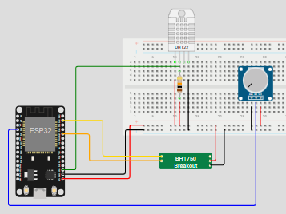

# 🌱 Hardware: Módulo de Monitoramento IoT

Este repositório contém o código e as especificações técnicas para o módulo de monitoramento botânico baseado em **ESP32**. O sistema realiza a leitura de variáveis ambientais e as transmite para o backend via API.

## 📋 Arquitetura do Sistema

O hardware coleta dados a cada **10 minutos**, otimizando consumo e persistência. Os sensores integrados são:

* **Sensor de Umidade de Solo:** monitoramento via leitura analógica.
* **DHT11:** monitoramento de temperatura e umidade do ar.
* **BH1750:** monitoramento de luminosidade (Lux) via protocolo I2C.

## 🔌 Pinagem (Conexões)

| Componente | Pino Componente | Pino ESP32 |
| --- | --- | --- |
| **Umidade Solo** | VCC | 3V3 |
|  | GND | GND |
|  | AO (Analog Out) | GPIO 34 |
| **DHT11** | VCC | 3V3 |
|  | GND | GND |
|  | DATA (Out) | GPIO 15 |
| **BH1750** | SCL | GPIO 22 |
|  | GND | GND |
|  | SCL | GPIO 22 |
| **BH1750** | VCC | 3V3 |
|  | GND | GND |
|  | SCL | GPIO 22 |
|  | SDA | GPIO 21 |

## ⚡ Esquema Elétrico

## 📦 Dependências (Bibliotecas)
Para compilar o código do projeto, certifique-se de instalar as seguintes bibliotecas no seu ambiente de desenvolvimento:

* **BH1750:** Comunicação I2C com o sensor de luminosidade.
* **DHT sensor library:** Leitura simplificada dos sensores DHT11/DHT22.
* **ArduinoJson:** Serialização e desserialização de objetos JSON para envio via API.
* **WiFiManager:** Gerenciamento dinâmico de credenciais Wi-Fi (portal cativo), evitando codificar a senha da rede diretamente no firmware.

## 🔄 Fluxo de Integração (API)

O ESP32 processa os dados antes do envio para a API FastAPI:

1. **Normalização:** Conversão ADC de 12 para 10 bits e conversão da umidade do solo para escala percentual (0-100%).
2. **Identificação:** O `MAC Address` do ESP32 atua como ID único e chave de autenticação.
3. **Serialização:** Agrupamento das leituras em um objeto JSON.
4. **Transmissão:** Envio via `POST` para o endpoint `/hardware/coleta`.

> **Nota:** O backend valida os dados via Pydantic e realiza o update no **Firebase Firestore**, garantindo a sincronização em tempo real com o App Flutter.